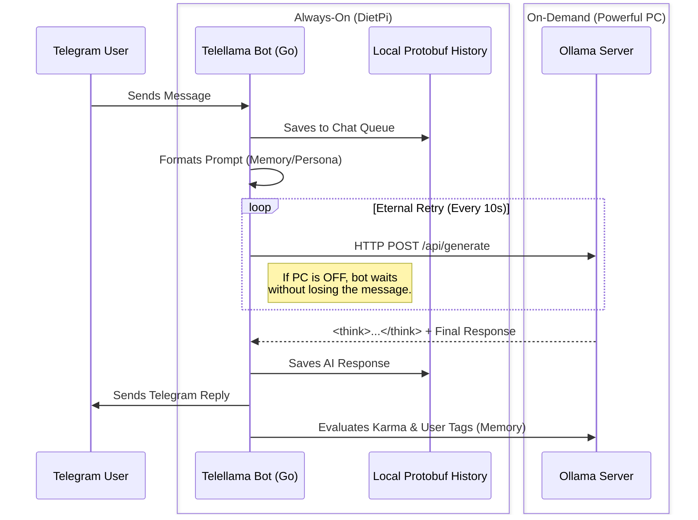

# Telellama 🦙💬

**Telellama** is a resilient, memory-aware, multi-bot Telegram framework powered by local LLMs (Ollama). 

It is specifically designed for a **split-architecture** deployment: running lightweight, always-on bots on a low-power device (like a Raspberry Pi / DietPi) while offloading the heavy AI inference to a high-power PC. 

## 🏗️ Architecture

The core philosophy of Telellama is **Resilient Asynchronous Inference**. The bot stays online 24/7 on your DietPi, receiving and persisting messages into a local Protobuf history. When the bot needs to reply, it attempts to contact your PC's Ollama instance. If your PC is turned off, the bot will gracefully queue the generation request, eternally retrying until the PC is booted up and the LLM becomes available.



## ✨ Key Features

*   **Split Environment:** PC (Heavy LLM) + DietPi (Always-on Go binary).
*   **Offline Queueing:** Messages trigger generation requests that wait securely until your PC is turned on. No dropped conversations.
*   **Docker/Podman Agnostic:** Seamlessly spin up containers regardless of your preferred engine.
*   **Advanced AI Pipelines:** 
    *   **Candidate Generation:** Generates multiple possible responses and evaluates them based on grammar and persona before replying.
    *   **Memory System:** Tracks user "Karma" (`+`, `-`, `=`) and persistent behavioral "Tags" (e.g., `#stubborn`).
    *   **Chain-of-Thought:** Automatically handles and denoises DeepSeek/Gemma `<think>` tags before sending messages to Telegram.

## 🚀 Quick Start

### 1. DietPi Setup (The Always-On Hub)
The DietPi handles Telegram polling, user memory, and the message queue. 

1. Ensure your bot's API keys are saved in a text file (one key per line).
2. Run the automated DietPi configuration script from the root directory:
   ```bash
   ./set-dietpi.sh
   ```
   *This script sets up the Go environment, initializes the persistent Protobuf history volume, and prepares the services.*

### 2. Container Setup (Docker / Podman Agnostic)
To spin up the bot containers, we provide a unified script that automatically detects and uses your active container engine (Docker or Podman) without requiring configuration changes.

Run this from the project root:
```bash
./set-containers.sh
```

### 3. PC Setup (The Heavy Lifter)
On your powerful PC, ensure(https://ollama.com/) is installed and accessible over your local network.

Configure your `ollama.env` file to point to your PC's static IP (e.g., `192.168.1.101`):
```env
OLLAMA_MODEL=hf.co/mradermacher/Gemma3-27B-it-vl-GLM-4.7...
OLLAMA_API_URL=http://192.168.1.101:11434/api/generate
```
*Note: Ensure your PC's firewall allows incoming connections on port `11434`.*

## ⚙️ Configuration

Configurations are dynamically loaded via JSON files without needing to recompile:

*   **Global Settings (`./confs/init.json`):**
    Defines allowed chat IDs, prompt templates, memory limits, message time-to-live (TTL), and default LLM parameters (Temperature, Top K, etc.).
*   **Bot-Specific Settings (`./confs/bots/<botname>.json`):**
    Defines the system prompt/persona (e.g., Flagria the Esperanto speaker) and the number of response candidates to generate before picking the best one.

## 🧹 Maintenance
The framework includes an automated memory cleaner (`history.Cleaner`) that respects the TTL settings defined in `init.json`. It routinely purges expired message chains from RAM and the disk-backed `.pb` files to ensure your DietPi never runs out of memory.
