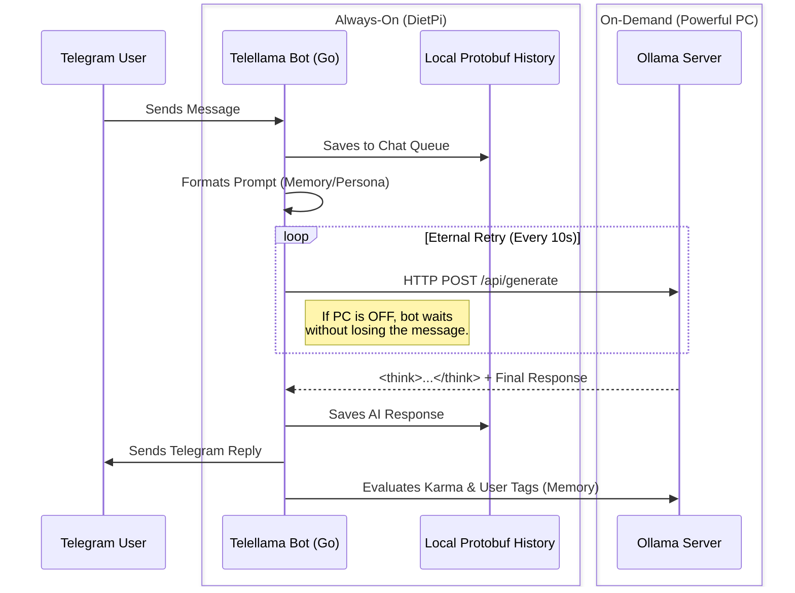

# Telellama 🦙💬

**Telellama** is a resilient, distributed, multi-bot Telegram framework powered by Ollama LLMs. 

## 🏗️ Architecture

It uses **distributed deployment**:
* **DietPi**: runs the bots, is **always**-on.
* **PC**: performs the AI inference, is **optionally**-on.

It implements **error-free strategy**:
1. The bots await new messages on Pi, writing them into a Protobuf history.
2. When the bots needs to reply, they try to reach for the PC's Ollama instance.
3. If Ollama is unreachable, the bots eternally retry the generation request.



## 🚀 Quick Start

### 1. DietPi Setup

1. Download ISO image (compressed as `.xz`) for your [Pi](http://www.orangepi.org/html/hardWare/computerAndMicrocontrollers/details/Orange-Pi-Zero-2W.html) from [DietPi website](https://dietpi.com/#download) 
2. Burn the image into [SD-card](https://www.sandisk.com/en-se/products/memory-cards/microsd-cards/sandisk-ultra-lite-uhs-i-microsd?sku=SDSQUNR-032G-GN3MA) with [Rufus](https://rufus.ie/en/) or similar program. Rufus natively supports the compressed format.
3. Set your variables in `set-dietpi.sh` and run it on the burned SD-card.
    ```bash
   ./set-dietpi.sh
   ```
Note: you may need to check and adjust your router's DHCP range.

### 2. PC Setup

1. `git clone https://github/vadimfedulov101/telellama`
2. `cd telellama`
3. Set static IP address.

```
# 1. Set the IP address
sudo nmcli connection modify "enp3s0" ipv4.addresses "192.168.0.101/24"

# 2. Set the Gateway
sudo nmcli connection modify "enp3s0" ipv4.gateway `ip route show default | awk '{print $3}'`

# 3. Set DNS
sudo nmcli connection modify "enp3s0" ipv4.dns "8.8.8.8,1.1.1.1"

# 4. Set to Manual
sudo nmcli connection modify "enp3s0" ipv4.method manual

# 5. Apply
sudo nmcli connection up "enp3s0"
```

*Note: you may need to make sure your router DHCP-range excludes just set 192.168.0.101. Use `ip route show default | awk '{print $3}` to get gateway (router) IP usable as a link.*

4. Configure `ollama.env` file to point to just set static IP.

```env
OLLAMA_API_URL=http://192.168.1.101:11434/api/generate
```

*Note for WSL users: Start `scripts/set-wsl-ports.ps1` on the Windows part for
correct port mapping. Don't forget to shut down farewall or add an exception
for :11434*

### 3. Container Setup (Docker / Podman Agnostic)

As it's **engine-agnostic**:
* Docker Compose container is set up by `./scripts/setup-containers.sh -d`
* Podman Quadlets container is set up by `./scripts/setup-containers.sh -p`

The container to set is **auto-deduced** by GPU presence.

## ⚙️ Configuration

Configurations are loaded on the boot from JSON files:

*   **Global Settings (`./confs/init.json`):**
    Defines allowed chat IDs, prompt templates, memory limits, message time-to-live (TTL), and default LLM parameters (Temperature, Top K, etc.).
*   **Bot-Specific Settings (`./confs/bots/<botname>.json`):**
    Defines the persona prompt and the number of response candidates to generate.
