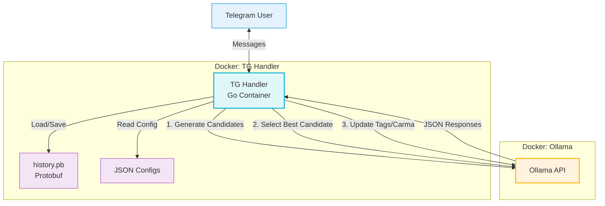

# TG-LLM-MultiBot 🚀

Advanced Framework for Multi-Bot LLM Orchestration in Telegram using Go, Ollama, and Protobuf.

## ✨ Key Features
*   **Multi-Persona Management**: Run distinct characters (e.g., *Revy*, *Frieren*) with unique system prompts, memories, and writing styles concurrently.
*   **Ollama Integration**: Self-hosted LLM inference using the `ollama` API (supports DeepSeek, Qwen, Mistral, etc.).
*   **Intelligent Pipeline**:
    *   **Candidate Selection**: Generates multiple responses and uses the LLM to pick the most authentic one.
    *   **Reflection**: Auto-generates "Carma" (Karma) updates and memory tags based on user interaction.
    *   **Cleanup**: Denoises `<think>` blocks and auto-translates outputs if configured.
*   **Protobuf Memory**: Efficient, binary-serialized conversation history (`history.pb`) separated into shared queues (public chats) and private chains.

## 🏗 Architecture

### 📊 Component Flow



## ⚙️ Configuration

### 1. Secrets & Environment
*   **Secrets**: Create `api_keys.txt` in the root directory. Add your Telegram Bot Tokens (one per line).
*   **Environment**: Create a `.env` file based on your deployment scenario.
    ```bash
    LLM_MODEL='richardyoung/qwen3-14b-abliterated:q8_0'
    # Use 'http://ollama:11434...' for Scenario A
    # Use 'http://192.168.1.101:11434...' for Scenario B
    LLM_API_URL='http://ollama:11434/api/generate' 
    ```

### 2. Global Settings (`confs/init.json`)
Controls paths, memory retention, and allowed chats.
```json
{
    "cleaner_settings": {
        "msg_ttl": "186h",       // Messages older than this are deleted
        "cleanup_interval": "12h"
    },
    "bot_settings": {
        "allowed_chats": {
            "usernames": ["admin_user"], // Admins for private chats
            "ids": [-100123456789]       // Allowed Public Group IDs
        }
    }
}
```

### 3. Bot Personas (`confs/bots/*.json`)
File name must match the Telegram Bot Username (e.g., `revy2_bot.json`).
```json
{
    "bot_conf": {
        "role": "System prompt describing the character...",
        "candidate_num": 3 // 1 = Speed (No selection), 3-5 = Quality (Selection logic)
    }
}
```

---

## 🚀 Setup & Scripts

Choose the scenario that fits your hardware availability.

### Scenario A: Single PC (Common)
Runs both the Bot Handler and the LLM on one machine (Linux/Windows with Docker).

1.  **Install Docker**: Ensure Docker Desktop (Windows) or Docker Engine (Linux) is installed.
2.  **GPU Support**: If on Linux, run `sudo ./scripts/set-nvidia.sh` to install the Nvidia Container Toolkit.
3.  **Run**:
    ```bash
    docker compose up -d
    ```

---

### Scenario B: Distributed (Optimized)
Splits the workload: A powerful PC/Server runs the LLM, and a low-power device (DietPi/RPi) runs the Telegram Bot.

#### Part 1: The PC (LLM Server)

**If using Linux:**
1.  Run `sudo ./scripts/set-nvidia.sh`.
2.  Run `docker compose -f docker-compose.pc.yml up -d`.

**If using Windows (WSL2):**
You must forward the WSL port to the host so the DietPi can reach it.
1.  Open **Task Scheduler** (`taskschd.msc`).
2.  Click **Create Task**.
    *   **General**: Name: `WSL Port Forward`. Check **"Run with highest privileges"** and **"Run whether user is logged on or not"**.
    *   **Triggers**: New -> **At system startup**.
    *   **Actions**: New -> **Start a program**.
        *   Program: `powershell.exe`
        *   Arguments: `-ExecutionPolicy Bypass -WindowStyle Hidden -File "C:\Path\To\Repo\scripts\set-wsl-ports.ps1"`
3.  Save and Restart.
4.  Run `docker compose -f docker-compose.pc.yml up -d`.

#### Part 2: The DietPi (Bot Handler)

1.  **Get the OS**: Download the image for your device from [DietPi.com](https://dietpi.com/#download).
2.  **Flash**: Use [Rufus](https://rufus.ie/en/) to burn the image to an SD card.
3.  **Configure Network Script**:
    *   Open `scripts/set-dietpi.sh` on your PC.
    *   Edit the `GATEWAY`, `IP`, `SSID`, and `KEY` variables with your network credentials.
    *   Copy the modified `set-dietpi.sh` to the root of the SD card (the visible partition).
4.  **Boot**: Insert SD card into the device and power on.
5.  **Execute**:
    *   Connect to the device (SSH or Keyboard).
    *   Mount the boot partition (if necessary) or find the script.
    *   Run: `sudo ./set-dietpi.sh`.
6.  **Install Docker**:
    *   Run: `sudo ./scripts/set-docker.sh`.
7.  **Start Bot**:
    *   Ensure `.env` has `LLM_API_URL` pointing to your PC's IP.
    *   Run: `docker compose -f docker-compose.pi.yml up -d`.
