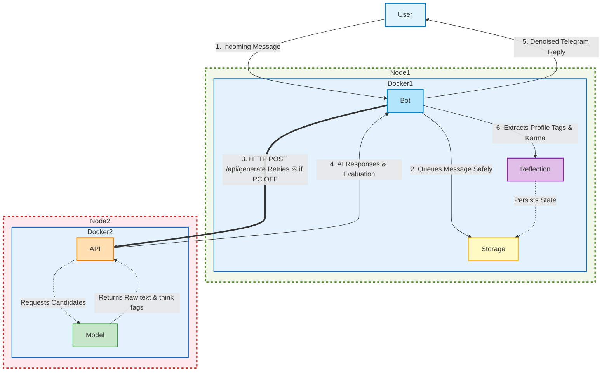

# Telellama 🦙💬

**Telellama** is a resilient, distributed, multi-bot Telegram framework powered by Ollama LLMs. 

## 🏗️ Architecture

It uses **distributed deployment**:
* **DietPi**: runs the bots, is **always**-on.
* **PC**: performs the AI inference, is **optionally**-on.

It implements **error-free strategy**:
1. The bots await new messages on DietPi, writing them into a Protobuf history.
2. When the bots needs to reply, they try to reach for the PC's Ollama instance.
3. If Ollama is unreachable, the bots eternally retry the generation request.



## 🚀 Quick Start

### 1. DietPi Setup

1. Download ISO image (compressed as `.xz`) for your Pi (e.g. Orange Pi Zero 2W) from [DietPi website](https://dietpi.com/#download) 
2. Burn the image to [SD-card](https://www.sandisk.com/en-se/products/memory-cards/microsd-cards/sandisk-ultra-lite-uhs-i-microsd?sku=SDSQUNR-032G-GN3MA) with [Rufus](https://rufus.ie/en/) or similar program. Rufus natively supports compressed format.
3. Set your variables in `set-dietpi.sh` and run it on the burned SD-card.
    ```bash
   ./set-dietpi.sh
   ```
Note: you may need to check and adjust your router's DHCP range.

### 2. PC Setup

1. Execute `wsl` in your commmand line and start `scripts/set-wsl-ports.ps1`
2. `git clone https://github/vadimfedulov101/telellama`
3. `cd telellama`

Configure `ollama.env` file to point to your PC's static IP (e.g., `192.168.1.101`):

```
# Get your gateway (router) IP
ip route show | grep default 
```

```env
OLLAMA_MODEL=hf.co/mradermacher/Gemma3-27B-it-vl-GLM-4.7...
OLLAMA_API_URL=http://192.168.1.101:11434/api/generate
```
*Note: Ensure your PC's firewall allows incoming connections on port `11434`.*

### 3. Container Setup (Docker / Podman Agnostic)

As it's **engine-agnostic**:
* Docker Compose container is set up by `./scripts/setup-containers.sh -d`
* Podman Quadlets container is set up by `./scripts/setup-containers.sh -p`

The container to set is **auto-deduced** by GPU presence.

## ⚙️ Configuration

Configurations are loaded on the boot from JSON files:

*   **Global Settings (`./confs/init.json`):**
    Defines allowed chat IDs, prompt templates, memory limits, message time-to-live (TTL), and default LLM parameters (Temperature, Top K, etc.).
*   **Bot-Specific Settings (`./confs/bots/<botname>.json`):**
    Defines the persona prompt and the number of response candidates to generate.
