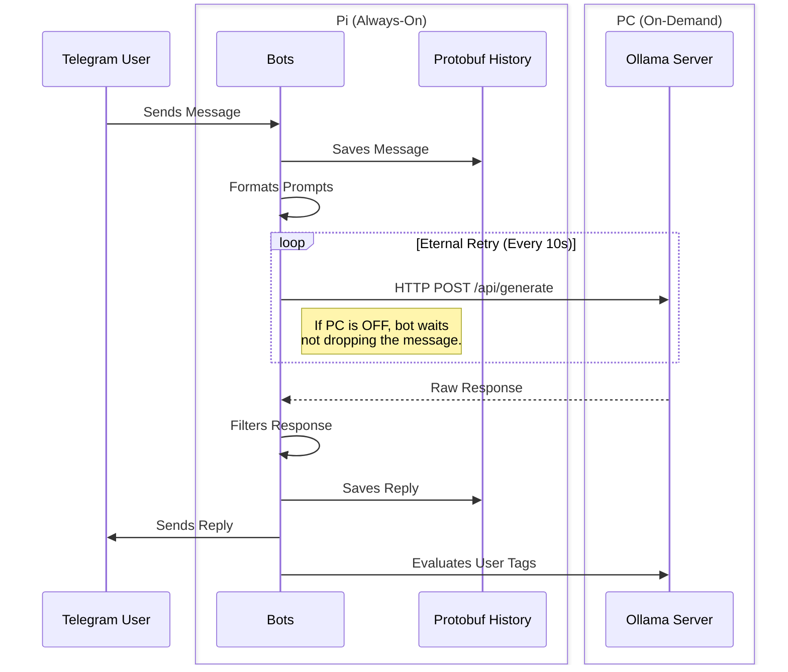

# Telellama 🦙💬

**Telellama** is a resilient, distributed, multi-bot Telegram framework powered by Ollama LLMs. 

## 🏗️ Architecture

**Distributed Deployment**:
* **Pi**: always-on, runs the bots.
* **PC**: on-demand, performs the inference.

**Failure-resilient Flow**:
1. The bots (Pi) await new messages.
2. When triggered, they try to reach for the Ollama (PC).
3. If Ollama is unreachable, the bots eternally retry the generation request.



## 🚀 Quick Start

### 1. Pi Setup

1. Download ISO image (as `.xz`) for your [Pi](http://www.orangepi.org/html/hardWare/computerAndMicrocontrollers/details/Orange-Pi-Zero-2W.html) from the [DietPi website](https://dietpi.com/#download) 
2. Burn the image into [SD-card](https://www.sandisk.com/en-se/products/memory-cards/microsd-cards/sandisk-ultra-lite-uhs-i-microsd?sku=SDSQUNR-032G-GN3MA) with [Rufus](https://rufus.ie/en/) (`.xz` supported) or other program.
3. Set your variables in `set-dietpi.sh` and run it on the burned SD-card.
    ```bash
   ./set-dietpi.sh
   ```
4. Start up your Pi and SSH into it.
    ```bash
    ssh root:192.168.0.102
    ```
5. Set up your Pi.
    ```
    # Install requirements
    sudo apt update
    sudo apt install -y \
        # container engine
        podman \
        # namespace utils
        dbus-user-session uidmap \
        # rootless net
        passt slirp4netns
        # version control & editor
        git neovim

    # Create sudo user with home and bash
    sudo useradd -m -s /bin/bash telellama
    sudo adduser telellama sudo

    # Unmask logind
    systemctl unmask systemd-logind

    # Start the services
    systemctl start systemd-logind
    systemctl start dbus

    # Set passport
    passwd telellama

    # Enter the user
    sudo -i -u telellama

    # Prohibit root SSH connections (connect as telellama from now on)
    /boot/dietpi/func/dietpi-set_software disable_ssh_password_logins root    

    # Set DietPi SSH for Git
    git config core.sshCommand "dbclient"
    git config core.sshCommand "dbclient -i ~/.ssh/id_dropbear"

    # Generate and show SSH keys to set in GitHub
    mkdir ~/.ssh
    dropbearkey -t ed25519 -f ~/.ssh/id_dropbear
    cat ~/.ssh.id_dropbear.pub
    ```

### 2. PC Setup

1. `git clone https://github/vadimfedulov101/telellama`
2. `cd telellama`
3. Set static IP address.
    ```bash
    # IP address to set
    IP="192.168.0.101"

    # Detect network vars
    IFACE=$(ip route show default | awk '{print $5}')
    GATEWAY=$(ip route show default | awk '{print $3}')

    # Apply the settings
    sudo nmcli connection modify "$IFACE" ipv4.addresses "$IP/24"
    sudo nmcli connection modify "$IFACE" ipv4.gateway "$GATEWAY"
    sudo nmcli connection modify "$IFACE" ipv4.dns "8.8.8.8,1.1.1.1"
    sudo nmcli connection modify "$IFACE" ipv4.method manual
    sudo nmcli connection up "$IFACE"
    ```
*Note: Your router DHCP-range must exclude just set IP address. Settings can be viewed via Gateway IP as a link: `ip route show default | awk '{print $3}`*

4. Configure `ollama.env` file to point to just set static IP.
    ```env
    OLLAMA_API_URL=http://192.168.1.101:11434/api/generate
    ```

5. Allow the Ollama port.
    ```bash
    # 1. Allow port 11434 through the firewall
    sudo firewall-cmd --add-port=11434/tcp --permanent
    # 2. Reload to apply changes
    sudo firewall-cmd --reload
    ```
WSL: `scripts/set-wsl-ports.ps1`

### 3. Container Setup (Docker / Podman Agnostic)

**Engine-agnostic**:
* Docker Compose: `./scripts/setup-containers.sh -d`
* Podman Quadlets: `./scripts/setup-containers.sh -p`

The container to set is **auto-deduced** by GPU presence.

## ⚙️ Configuration

Configurations are loaded on the boot from JSON files:

*   **Global Settings (`./confs/init.json`):**

    Defines allowed chat IDs, prompt templates, memory limits, message time-to-live (TTL), and default LLM parameters (Temperature, Top K, etc.).

*   **Bot-Specific Settings (`./confs/bots/<botname>.json`):**

    Defines the persona prompt and the number of response candidates to generate.
